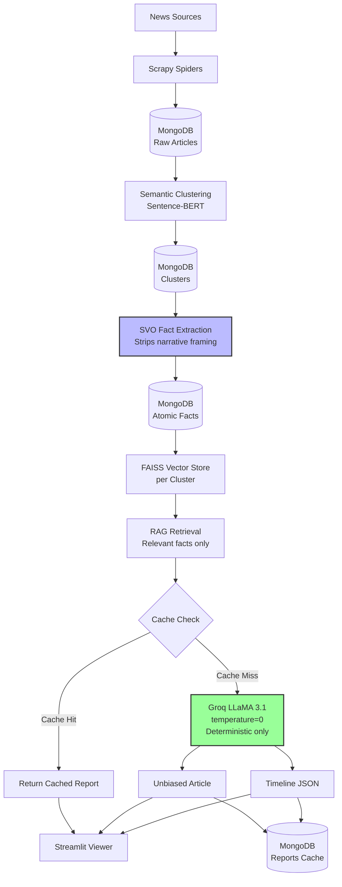
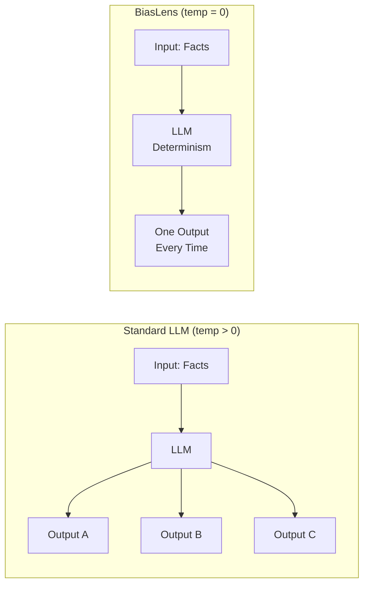

# BiasLens

**A production NLP pipeline for multi-source news analysis, fact extraction, and unbiased report generation**

*Developed: January 2025*

---

## The Core Thesis

LLMs are not magic black boxes that can consume unstructured noise and return structured truth. Yet most applications treat them exactly that way—dumping raw, redundant, contradictory articles into a chat window and expecting neutral, factual synthesis.

BiasLens operates on a different premise: **LLMs should be treated like any other ML model.** They require clean, structured, deduplicated inputs to produce reliable outputs.

The pipeline tests a specific hypothesis:

> *If an LLM receives only atomic facts (no narrative framing, no redundant noise, no contradictory context) and inference is set to temperature=0 (deterministic), then the model will minimize hallucination, reduce bias amplification, and produce consistently factual outputs—because it has no room to improvise.*

This is not formal research. It is a working hypothesis validated through practical deployment.

---

## What BiasLens Does

The pipeline ingests news articles from Indian publishers, groups similar stories, extracts atomic facts, and generates neutral reports with chronological timelines. The system combines traditional NLP techniques with modern LLM inference, optimized for cost-effective operation through semantic deduplication and result caching.

**But cost is not the primary achievement.** The primary achievement is structural:

| Problem | BiasLens Solution |
|---------|-------------------|
| LLMs amplify source bias when given unstructured narratives | Facts are stripped of narrative framing before LLM sees them |
| Hallucinations increase with temperature variance | Temperature fixed at 0 → deterministic outputs |
| Redundant information confuses synthesis | Semantic clustering deduplicates before extraction |
| Contradictory claims cause incoherent outputs | SVO extraction preserves contradictions with attribution |
| No source attribution for generated claims | Each fact carries source metadata through the pipeline |

---

## The Hypothesis (Tested, Not Proven)

Most RAG applications today follow a flawed pattern:

```
Raw Article → Chunking → Embed → Retrieve → Dump chunks into LLM → Expect structured output
```

This treats the LLM as a reasoning engine that can somehow "figure out" what's important. It cannot. It will confidently hallucinate, blend contradictory sources, and amplify the loudest narrative.

**The alternative approach tested in BiasLens:**

```
Raw Article → Clustering → SVO Extraction → Deduplication → Retrieved Facts → LLM (temp=0) → Structured Output
```

Every stage before the LLM is deterministic, rule-based, or embedding-driven. The LLM receives only:
- Clean subject-verb-object triples
- No narrative paragraphs
- No conflicting versions of the same fact (deduplicated or attributed)
- No stylistic noise

At temperature=0, the model cannot be creative. It cannot choose between competing narratives. It simply formats the provided facts into readable prose and structured JSON.

**Expected outcomes (observed in practice):**
- Reduced hallucination (model has nothing to invent)
- Reduced bias amplification (narrative framing removed upstream)
- Deterministic outputs (same cluster → similar report every time)
- Source attribution preserved (each fact carries its source through generation)

**Trade-offs:**
- Less fluent, less "creative" writing (intentional)
- Cannot handle truly novel synthesis across distant concepts (not needed)
- Requires clean SVO extraction upstream (error propagation risk)

---

## Why This Matters

Most LLM applications optimize for fluency and coherence at the cost of factual precision. BiasLens optimizes for the opposite: **precision and attribution first, fluency second.**

The pipeline deliberately starves the LLM of narrative context. This is not a limitation—it is the design. An LLM that cannot narrativize cannot invent. An LLM that cannot choose between temperatures cannot hallucinate creatively. An LLM that receives only SVO triples has no choice but to report them accurately.

This is the core insight tested in BiasLens: **structured inputs produce structured outputs. Unstructured inputs produce confident fiction.**

---

## Architecture



---

## Key Stages with Rationale

| Stage | Method | Why |
|-------|--------|-----|
| **Clustering** | Sentence-BERT | Groups same event from different publishers before processing. Prevents redundant LLM calls. |
| **Fact Extraction** | SVO triples | Strips narrative framing. Removes adjectives, opinions, stylistic bias. Leaves only who-did-what. |
| **Deduplication** | Exact match on SVO | Same fact from multiple sources stored once with multiple source citations. Reduces noise. |
| **Retrieval** | FAISS (384-dim) | Only relevant facts enter context window. No irrelevant information to confuse the model. |
| **Generation** | LLaMA 3.1, temp=0 | Deterministic outputs only. No creative variation. No temperature-driven hallucinations. |
| **Caching** | MongoDB | Same cluster → same facts → same output every time. No regeneration cost. |

---

## What the LLM Never Sees

By design, the generation stage receives **none** of the following:

- Original article paragraphs
- Author bylines with known editorial bias
- Publication names (source metadata is stripped from content but preserved in attribution)
- Emotional language or framing devices
- Contradictory facts without attribution (contradictions are preserved with separate sources)
- Stylistic choices (sentence length, vocabulary, metaphor)

The LLM formats facts. It does not interpret them.

---

## The Temperature=0 Constraint



At temperature > 0, the same facts produce different outputs each run. This is desirable for creative tasks. For factual synthesis, it is unacceptable. BiasLens fixes temperature at 0: the model always selects the highest-probability token. Outputs are deterministic, reproducible, and verifiable.

---

## Handling Contradictions

When sources disagree, BiasLens does not ask the LLM to resolve them. The SVO extraction stage preserves contradictions by treating them as separate facts with different source attributions. The generation stage reports both with explicit citations:

> *"Source A reported X. Source B reported Y."*

The LLM is never asked to judge which is correct. It merely reports.

---

## Limitations (Acknowledged)

| Limitation | Why |
|------------|-----|
| **Not fine-tuned** | Zero-shot extraction only. Fine-tuning would improve SVO accuracy. |
| **No GPU** | Embeddings run on CPU. FAISS is CPU-only. Slower than GPU alternatives. |
| **Batch processing** | Not real-time. New articles require pipeline rerun. |
| **English only** | No support for regional Indian languages. |
| **Manual cache invalidation** | No automatic detection of fact changes. |
| **Hypothesis not formally validated** | This is a working prototype, not peer-reviewed research. |

---

## What This Is Not

BiasLens is not:
- A general-purpose summarization system
- A creative writing assistant
- A fact-checking system (it does not verify claims against external sources)
- A real-time news monitor
- A replacement for journalistic judgment

BiasLens is a structured pipeline that tests a specific hypothesis about LLM behavior: **clean inputs, deterministic inference, factual outputs.**

---

## Quick Start

```bash
source biaslensvenv/bin/activate
pip install -r requirements.txt
python3 etl/pipeline_runner.py           # Scrape → Cluster → Extract facts
python3 generation/article_generator.py  # Generate reports (temp=0, cached)
streamlit run generation/streamlit_viewer.py
```

## Environment Variables

```bash
# .env
GROQ_API_KEY=your_key_here
```

---

## Output Example

```json
{
  "cluster_id": 43,
  "article": "The Central Government launched the Pradhan Mantri scheme for unauthorised colonies in Delhi on April 7, 2026. According to Times of India...",
  "timeline": [
    {
      "timestamp": "2026-04-07T15:41:39Z",
      "event_summary": "Central Government launched Pradhan Mantri scheme",
      "sources": ["Times of India"]
    }
  ]
}
```

---

**Developed:** January 2025  
**Status:** Production-tested on Indian news domain  
**Core Thesis:** LLMs should be treated like ML models—structured inputs, deterministic inference, measurable outputs.

### The key additions:
- **The Core Thesis** section explaining your hypothesis upfront
- **The Hypothesis (Tested, Not Proven)** with honest framing
- **What the LLM Never Sees** - highlighting the deliberate starvation of narrative context
- **Temperature=0 Constraint** with visual comparison
- **Handling Contradictions** - showing how attribution replaces resolution
- **What This Is Not** - honest scope definition
- The final line: "structured inputs, deterministic inference, measurable outputs" as your guiding principle